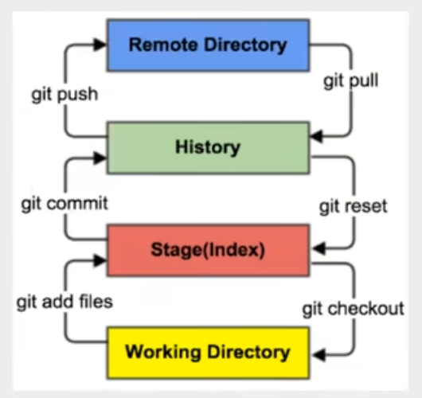
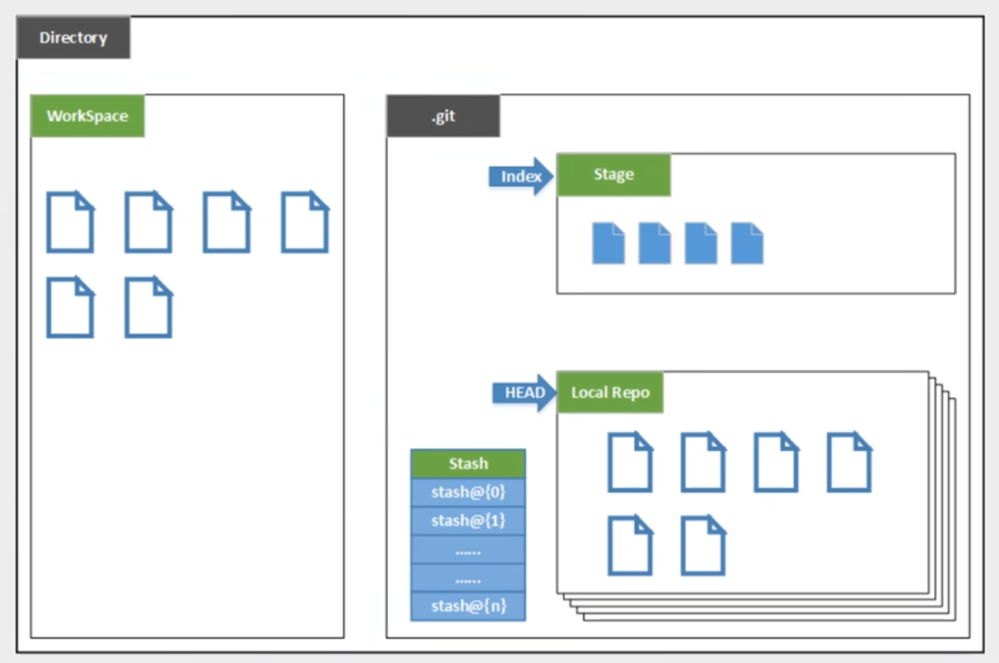
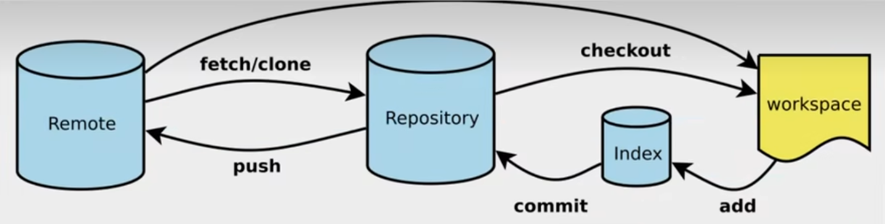

## Git安装与卸载

安装按照其安装包顺序傻瓜安装即可

卸载前一定注意连同环境变量一并卸载

__Git Bash__: Unix与Linux风格的命令行

__Git CMD__: Windows风格的命令行

__Git GUI__: 图形界面的Git

## 基本Linux命令

| 命令    | 含义                                       |
| ------- | ------------------------------------------ |
| cd      | 切换目录                                   |
| cd..    | 回退目录                                   |
| pwd     | 显示当前目录路径                           |
| ls(ll)  | 列出当前目录中所有文件，加上(ll)列出更详细 |
| touch   | 新建文件                                   |
| rm      | 删除文件                                   |
| mkdir   | 新建文件夹                                 |
| rm -r   | 删除文件夹                                 |
| mv      | 移动文件                                   |
| reset   | 重新初始化终端/清屏                        |
| clear   | 清屏                                       |
| history | 查看命令历史                               |
| help    | 帮助                                       |
| exit    | 退出                                       |
| #       | 注释                                       |

以下命令为递归清除根目录，即初始化系统，切勿在linux系统中使用

```linux
rm -rf /
```

类似的，基本Dos命令如下

| 命令               | 含义         |
| ------------------ | ------------ |
| cd E:\FolderName   | 同盘切换目录 |
| cd..               | 回退目录     |
| cd/d E:\FolderName | 跨盘切换目录 |
| cls                | 清屏         |
| exit               | 退出         |
| ipconfig           | 查看电脑ip   |
| calc               | 计算机       |
| mspaint            | 画图         |
| notepad            | 记事本       |
| ping + URL         | ping命令     |
| md + FileName      | 创建文件夹   |
| >cd> + FileName    | 创建文件夹   |
| del + FileName     | 删除文件夹   |
| rd + FileName      | 移除目录     |

## Git配置

产看配置

```linux
git config -l
```

查看系统配置

```linux
git config --system --list
```

查看本地本配置

```linux
git config ==global --list
```

配置本地

```linux
git config --global user.name "Kasper"
```

```linux
git config --global user.email "123456@gmail.com"
```

## Git基本工作原理



- Workspace: 工作区，即本地存放代码的地方
- Index/Stage: 暂存区，临时存放改动的地方，实际上是个文件
- Repository: 仓库区，安全存放数据的位置，其中HEAD指向最新放入仓库的版本
- Remote: 远程仓库，托管代码的服务器

本地目录结构如下



Git的工作流程为：

1. 在工作目录中添加、修改文件
2. 将需要进行版本管理的文件放入暂存区域；
3. 将暂存区域的文件放入Git仓库

故Git管理文件有三种状态：已修改(modified)、已暂存(staged)、已提交(committed)

## Git项目搭建

Git常用命令其实只有六个



新建仓库

```linux
git init
```

远程克隆仓库

```linux
git clone URL
```

## Git文件操作

文件的四种状态

- Untracked：未跟踪，此文件在文件夹中，但未加入Git库，不参与版本控制，通过<font color="white" style="background:green">git add</font>状态变为<font color="white" style="background:green">Staged</font>。
- Unmodify：文件已入库，未修改。该文件有两种去处，如果被修改则变为<font color="white" style="background:green">Modified</font>，如果使用<font color="white" style="background:green">git rm</font>移除版本库，则成为<font color="white" style="background:green">Untracked</font>文件。
- Modified：文件已修改，未进行其他操作，可以通过<font color="white" style="background:green">git add</font>进入缓存<font color="white" style="background:green">staged</font>状态，使用<font color="white" style="background:green">git checkout</font>则丢弃修改，返回到<font color="white" style="background:green">unmodify</font>状态。<font color="white" style="background:green">git checkout</font>即从库中取出文件覆盖。
- Staged：暂存状态，执行<font color="white" style="background:green">git commit</font>则将修改同步到库中，此时库中文件与本地文件变为一致，文件为<font color="white" style="background:green">Unmodify</font>状态，执行<font color="white" style="background:green">git reset HEAD filename</font>取消暂存，文件状态为<font color="white" style="background:green">Modified</font>

查看指定文件状态

```linux
git status [filename]
```

查看所有文件状态

```linux
git status
```

添加所有文件到暂存区

```linux
git add .
```

提交暂存区内容到本地仓库，-m后为本次提交的说明信息

```linux
git commit -m "Message of This Commit"
```

忽略文件

在主目录下建立“.gitignore”文件，此文件有以下规则

1. 文件中的空行或以#开始的行会被忽略。
2. 可以使用Linux通配符。如：*代表任意多个字符，？代表一个字符，[adc]代表可选字符范围，{string1,string2,...}代表可选字符串。
3. 若名称的最前面有！表示例外规则，不会被忽略。
4. 若名称的最前面有/表示忽略的文件在此目录下，子目录中的文件不被忽略。
5. 若名称的最后面有/表示忽略的是此目录下该名称的子目录，而非文件

举例如下

| 写法      | 含义                                         |
| --------- | -------------------------------------------- |
| *.txt     | 忽略所有.txt结尾的文件                       |
| !lib.txt  | 但lib.txt除外                                |
| /temp     | 仅忽略根目录下的TODO文件，不包括temp         |
| build/    | 忽略build/目录下所有文件                     |
| doc/*.txt | 忽略doc/note.txt但不包括doc/server/arch..txt |

## 配置SSH及创建远程仓库

进入 C:\Users\Administrator\.ssh目录，生成公钥

```linux
ssh-keygen -t rsa
```

将public key添加到GitHub账户中即可。

GitHub中创建一个自己的仓库

许可证：开源是否可以随意转载，开源但是不能商业使用，不能转载，...限制
